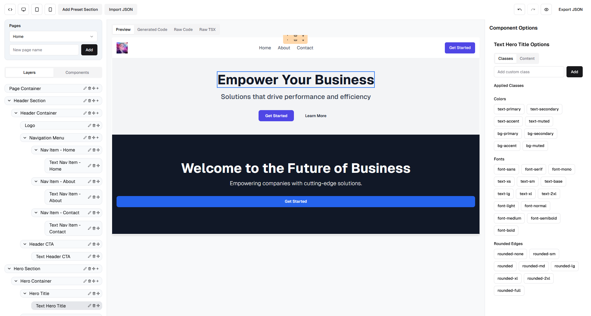
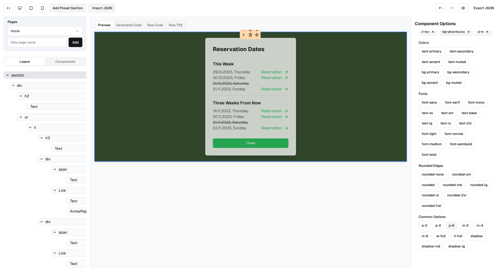
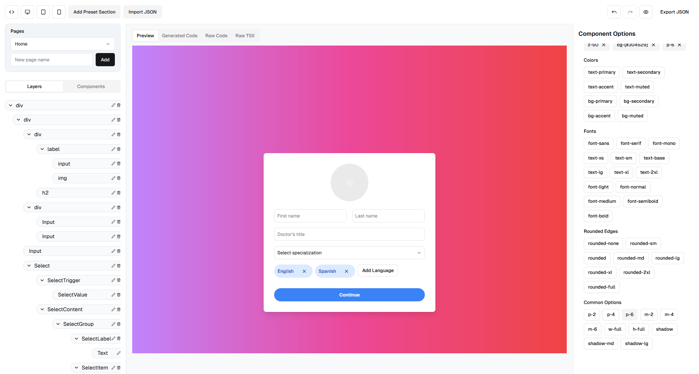
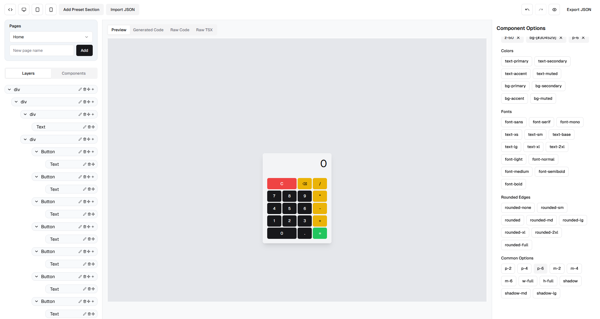

# Traqix LowCode/NoCode Editor



Traqix LowCode/NoCode Editor is a powerful tool for designing visual interfaces for systems and websites. Built on **Tailwind CSS** and using **ShadCN-UI** components, it simplifies the creation of layouts and components such as tables, charts, forms, and panels.

With a modern and intuitive interface, this editor allows developers to create responsive and interactive UI elements visually, while maintaining control over the Tailwind CSS classes. It also integrates with Vercel’s **v0**, enabling the reuse of AI-generated components, allowing seamless import and manipulation of these components within the editor.

**Note:** This project is under active development and may contain bugs or unexpected behavior.

---

## Key Features

- **Visual Component Builder:** Drag and drop UI components like tables, forms, charts, and widgets onto the canvas.
- **Tailwind CSS Integration:** Complete control over CSS styles with Tailwind's utility-first approach.
- **ShadCN-UI Components:** Reusable UI components that are easy to customize and integrate.
- **AI Component Import:** Direct integration with **Vercel v0**, allowing you to import and customize AI-generated UI designs.
- **Real-Time Code Export:** Export your design as **TSX** code or **JSON** for further integration into your projects.
- **JSON Import:** Load saved layouts or work on existing designs by importing JSON configurations.

---

## Technologies Used

- **Next.js**
- **TypeScript**
- **Tailwind CSS**
- **ShadCN-UI**
- **Vercel v0** integration

---

## How to Use

1. Clone the repository:
   ```bash
   git clone https://github.com/yourusername/traqix-lowcode-editor.git
   ```

2. Navigate to the project directory:
   ```bash
   cd traqix-lowcode-editor
   ```

3. Install dependencies:
   ```bash
   npm install
   ```

4. Run the development server:
   ```bash
   npm run dev
   ```

5. Open your browser and navigate to:
   ```
   http://localhost:3000
   ```

---

## Project Status

The Traqix LowCode/NoCode Editor is currently in **active development**. While the core functionality is stable, new features are continuously being added, and there may be bugs or areas of improvement. Contributions, feedback, and bug reports are highly appreciated.

---

## Contributing

Contributions are welcome! To get started:

1. **Fork** the repository.
2. Create a new branch: `git checkout -b feature/new-feature`.
3. Make your changes and commit them: `git commit -m 'Add new feature'`.
4. Push to the branch: `git push origin feature/new-feature`.
5. Open a **Pull Request**.

---

## Screenshots and Demo

### Editor in Action


*An overview of the Traqix LowCode/NoCode Editor interface.*


*Customizing components with Tailwind CSS classes.*


*Building a page layout with drag-and-drop components.*

### Video Demo


*Click on the image to watch the demo video.*

---


## License

This project is licensed under the **MIT License**.

---

This README is now optimized for GitHub and includes all the details for setting up, running, and contributing to the Traqix LowCode/NoCode Editor. You can directly copy it into your repository.